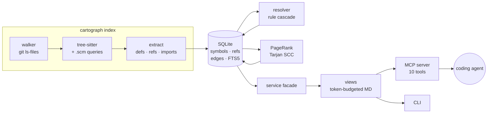

# Cartograph

**Agent-native code intelligence.** Turn any repository into a queryable code graph and serve it to coding agents over [MCP](https://modelcontextprotocol.io) — so an agent can ask *"what breaks if I change this?"* instead of grepping and hoping.

tree-sitter + SQLite. No embeddings, no vector store, no API keys, no server, no cost.

[](https://github.com/GokulRaj2210/cartograph-mcp/actions/workflows/ci.yml)


---

## The problem

Give a coding agent a large unfamiliar repo and watch what it does: `grep`, read a file, `grep` again, read another file. It burns context reconstructing structure that a parser could have told it in one call — and it still misses the caller three modules away that its change just broke.

The usual fix is RAG: embed the codebase, retrieve "similar" chunks. But *"who calls this function?"* is not a similarity question. It has an exact answer, and that answer lives in the call graph.

Cartograph builds the graph, then hands agents nine tools shaped for how they actually work.

```console
$ cartograph blast src/cartograph/graph/store.py

## Blast radius — file `src/cartograph/graph/store.py`

14 dependent file(s), 30 affected symbol(s), 6 test file(s).

**Tests to run first**
- `tests/test_cli.py`
- `tests/test_incremental.py`
- `tests/test_mcp.py`
- `tests/test_resolver.py`
- `tests/test_traversal.py`
- `tests/test_views.py`

**Dependent files** (by import distance)
- `src/cartograph/graph/resolver.py` · d1
- `src/cartograph/indexer/pipeline.py` · d1
- `src/cartograph/service.py` · d1
- `src/cartograph/cli.py` · d2
…
```

One call, before the edit. Not seven greps after the test suite goes red.

---

## Quickstart

```bash
uv tool install cartograph-mcp     # or: pipx install cartograph-mcp

cartograph index ~/code/my-repo    # builds .cartograph/cartograph.db
cartograph arch                    # modules, layers, cycles, hotspots
cartograph blast src/auth/token.py # what a change here could break
cartograph callers validate_token  # reverse call tree
```

### Wire it into an agent

Claude Code:

```bash
claude mcp add cartograph -- cartograph serve /path/to/repo
```

Or any MCP client, via `mcp.json`:

```json
{
  "mcpServers": {
    "cartograph": {
      "command": "cartograph",
      "args": ["serve", "/path/to/repo"]
    }
  }
}
```

`serve` indexes on first run if no index exists. Then ask your agent *"what would break if I changed the token validator?"* and it will call `blast_radius` instead of guessing.

---

## The nine tools

| Tool | Answers |
|---|---|
| `find_symbol` | Where is X defined? (ranked by structural importance) |
| `search_code` | Full-text over names, signatures, docstrings (BM25) |
| `get_symbol` | One symbol: signature, doc, members, callers, callees, source |
| `who_calls` | Reverse call tree — before you change a signature |
| `what_it_calls` | Forward call tree — understand code without reading every file |
| `blast_radius` | What a change could break, **and which tests to run** |
| `related_symbols` | "What else should I read?" via personalized PageRank |
| `file_summary` | What a file defines, imports, and who imports it |
| `architecture_overview` | Modules, layering, import cycles, hotspots, entry points |

Plus MCP resources (`cartograph://architecture`, `cartograph://stats`) and an `orient` prompt for a graph-first first pass at an unfamiliar repo.

**Languages:** Python, TypeScript, TSX, JavaScript, Go.

---

## Design decisions worth arguing about

### 1. Confidence is a first-class column

Without a type checker you cannot *know* that `store.who_calls()` means `GraphStore.who_calls`. You can only rank hypotheses. So rather than pretending, every edge records the rule that produced it and a confidence:

| Rule | Confidence | Intuition |
|---|---|---|
| `same-file` | 0.95 | the definition is right there in scope |
| `import` | 0.90 | the file explicitly imported this name |
| `receiver-type` | 0.85 | `Foo.bar()` where `Foo` is a known container |
| `same-module` | 0.75 | sibling file in the same package |
| `unique-global` | 0.60 | exactly one repo symbol has this name, bare call |
| `name-only` | 0.45 | one match, but on an **untyped receiver** |
| `ambiguous` | ≤0.40 | N candidates, kept as N edges at 1/N each |
| `external` | 0.00 | rooted at a third-party/stdlib import |
| `unresolved` | 0.00 | genuinely unknown (dynamic, or a typed method) |

Callers then choose their own operating point. `who_calls` defaults to ≥0.5 — **precision first**, because an agent *acts* on the answer. `blast_radius` drops to 0.3 — **recall first**, because a missed impacted test is the expensive mistake and a false positive only costs a reviewer a glance.

That `name-only` tier exists because of a real bug. `seen.add(...)` on a builtin `set` was resolving to a repo class's `add` method, purely because the name happened to be unique — and it showed up as a confident caller. A method name on a receiver you cannot type is not evidence, so it now lands below the precision line. ([test](tests/test_resolver.py))

`external` exists for honesty about metrics: on most repos the "unresolved" bucket is dominated by `typer.Option` and `sqlite3.execute`. Lumping those in makes coverage look far worse than it is, so Cartograph reports **internal resolution** — of the call sites that *could* hit a repo symbol, how many did.

### 2. Parsing is incremental; resolution never is

A file is reparsed only when its sha256 moves. But raw references are stored as *facts* in a `refs` table, and `edges` is recomputed as a pure function of (refs × symbols) whenever anything changed.

This is what makes "reindex after every edit" trustworthy. If resolution were also incremental, editing one file could leave an edge in *another* file pointing at a symbol that had moved. Global re-resolution makes that structurally impossible. ([test](tests/test_incremental.py))

The cost is real, so there is exactly one safe shortcut: if no file was added, reparsed, or removed, both input tables are unchanged and resolution is provably identical — so it is skipped. That took a no-op reindex of Django from **7.5s to 0.67s** with a byte-identical graph.

### 3. PageRank instead of embeddings

"Which `get` did you mean?" is a *structural* question. The `get` that forty call sites depend on is the one the agent wants, and the call graph already knows that. So symbol ranking is weighted PageRank over the call graph — stable, explainable, and free. No model, no index build, no vector store.

`related_symbols` extends the same idea: personalized PageRank seeded on one symbol, treating the graph as undirected, because when you are about to change a function both its callers and its callees are relevant context. It is the structural analogue of semantic search, and it needs no embeddings.

### 4. Tools return Markdown, not JSON, under a token budget

The consumer is a context window. A 40-symbol JSON array spends thousands of tokens on braces and repeated keys, and the model reformats it anyway. Every view here is compact Markdown with a hard token budget.

Critically, **every truncation is announced**. An agent handed 20 of 87 callers with no marker will confidently conclude the other 67 do not exist, and then delete something.

### 5. Traversal runs in SQLite, not Python

`who_calls` at depth 4 is a recursive CTE, so the whole traversal stays inside SQLite's C loop. On Django's 252k-edge graph that is ~5ms. Pulling the edge table into Python to walk it would not be.

---

## Benchmarks

Real repositories, M-series laptop, single process. Cold = full index from scratch; warm = no-op reindex.

| Repo | Files | KLOC | Symbols | Edges | Cold | Warm | DB | Internal resolution |
|---|--:|--:|--:|--:|--:|--:|--:|--:|
| [django](https://github.com/django/django) | 2,973 | 534 | 45,394 | 252,441 | 11.9s | 0.67s | 80 MB | 83.2% |
| [gin](https://github.com/gin-gonic/gin) (Go) | 98 | 24 | 1,610 | 9,179 | 0.32s | 0.03s | 2.5 MB | 88.1% |
| [flask](https://github.com/pallets/flask) | 83 | 18 | 1,624 | 4,271 | 0.21s | 0.03s | 1.7 MB | 87.4% |

Query latency (median of 5, warm):

| Repo | `find_symbol` | `who_calls` d3 | `blast_radius` | `architecture_overview` |
|---|--:|--:|--:|--:|
| django | 12.3ms | 5.1ms | 5.6ms | 68.5ms |
| gin | 0.4ms | 0.4ms | 0.5ms | 1.2ms |
| flask | 0.5ms | 1.1ms | 1.3ms | 1.8ms |

Reproduce with `scripts/bench.py`.

---

## Architecture



| Module | Responsibility |
|---|---|
| `indexer/walker.py` | File discovery — defers to `git ls-files` for correct `.gitignore` semantics |
| `indexer/languages.py` | One adapter per language: extensions, queries, docstrings, module keys, import resolution |
| `indexer/extract.py` | AST → symbols/references/imports, language-agnostic |
| `queries/*.scm` | tree-sitter capture patterns — the per-language knowledge, as data |
| `graph/schema.sql` | The graph: `files`, `symbols`, `refs`, `edges`, `imports`, FTS5 |
| `graph/resolver.py` | The confidence cascade |
| `graph/algorithms.py` | PageRank, personalized PageRank, iterative Tarjan SCC, layering |
| `graph/store.py` | Recursive-CTE traversal, ranked lookup, aggregates |
| `service.py` | One facade so the CLI and MCP server cannot drift |
| `views.py` | Token-budgeted Markdown |

### Scoping without combinatorial queries

The trick that keeps `queries/*.scm` small: scope is never encoded in the query. Every captured definition is indexed by its tree-sitter node id, and a reference's enclosing symbol is found by walking its `parent` chain until it hits one. That is O(tree depth) per reference and handles closures, methods, inner classes, and arrow functions for free — no per-shape patterns.

### Adding a language

Subclass `LanguageAdapter` (~40 lines) and drop in a `.scm` file. `GoAdapter` is the shortest complete example. `tests/test_queries.py` then automatically compiles your queries against the grammar and asserts they capture something.

---

## Development

```bash
git clone https://github.com/GokulRaj2210/cartograph-mcp && cd cartograph-mcp
uv sync
uv run pytest -q          # 195 tests
uv run ruff check .
uv run mypy               # strict
```

CI runs the suite on Python 3.11/3.12/3.13 (plus macOS), then **dogfoods**: it indexes this repo, fails on import cycles, asserts a no-op reindex reparses nothing, and drives the MCP server over real stdio. It also installs the built wheel into a clean venv and indexes with it, because packaged `.scm` files are easy to leave out of a wheel and impossible to notice locally.

The cycle gate has already earned its keep — it caught a `store → resolver → store` cycle that I introduced in this repo, which was fixed by moving the offending helper rather than by relaxing the gate.

### Notable tests

- `tests/test_queries.py` — every `.scm` compiles against **every** grammar that loads it, and captures something. A pattern valid in JavaScript (`(class_heritage (identifier))`) is an *Impossible pattern* in TypeScript, which wraps supertypes in `extends_clause`. That one line silently produced zero TypeScript symbols.
- `tests/test_incremental.py` — no stale edges after edits, deletions, or a symbol moving between files.
- `tests/test_resolver.py` — every rule fires, and none over-claims its confidence.
- `tests/test_cli.py` — a reader and an indexer can hold the database at once.

---

## Limitations

Stated plainly, because a code-intelligence tool that oversells its precision is worse than useless:

- **No type inference.** `self.conn.execute(...)` cannot be resolved to a repo symbol without knowing `conn`'s type. Those land in `unresolved`, and they are the bulk of what remains at ~85% internal resolution.
- **Dynamic dispatch is invisible.** `getattr(obj, name)()`, decorator registries, and DI containers do not appear as edges.
- **Cross-language edges are not tracked.** A TypeScript frontend calling a Python endpoint is two disconnected subgraphs.
- **Definitions only, not every reference.** A symbol used as a value (passed as a callback) is weaker in the graph than one that is called.

Roadmap: Rust and Java adapters, optional LSP enrichment for exact resolution where a language server is available, and a `--changed-since <ref>` mode for PR-scoped blast radius.

---

## Why this exists

I wanted to know whether a coding agent's biggest weakness on large repos — no structural model of the code — could be fixed with static analysis and a well-shaped tool surface rather than a bigger model or a vector database. Mostly, it can.

## License

MIT
